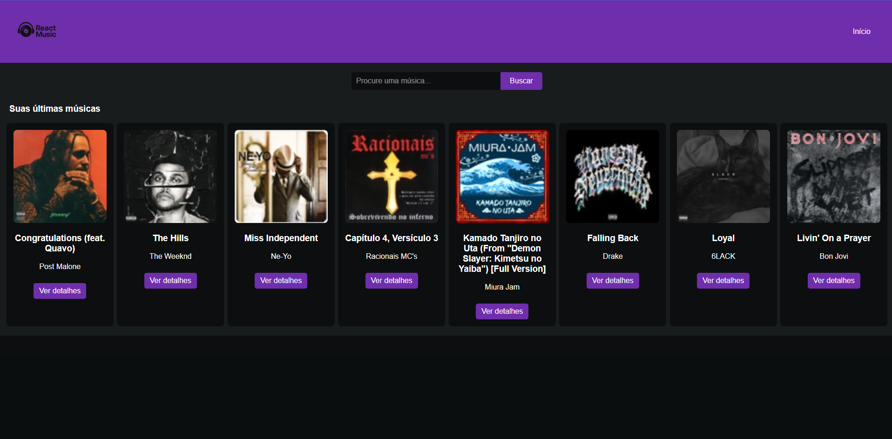
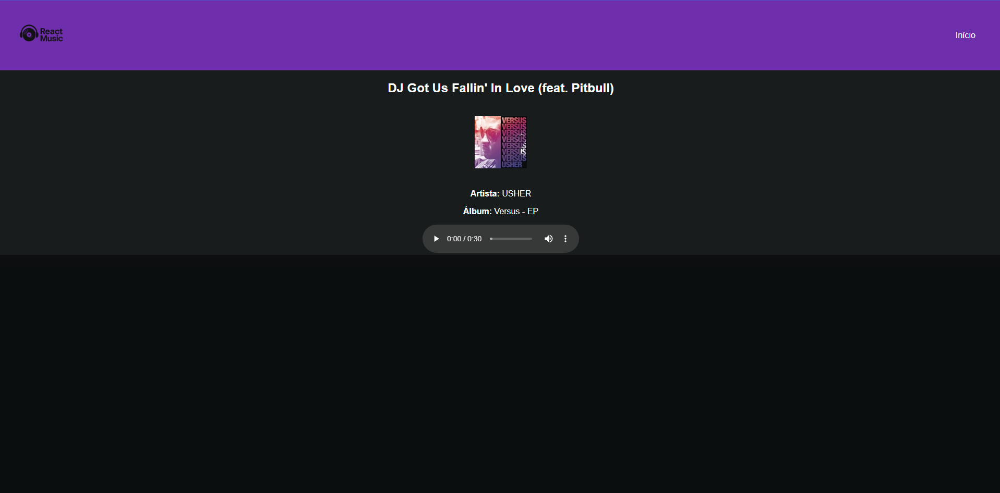

# 📌 Projeto: ReactMusic 🎵

---

## 🚀 Descrição
Este projeto é uma aplicação desenvolvida em React que simula um reprodutor de músicas. A aplicação consome dados de APIs públicas para listar músicas e permitir a navegação entre elas de forma interativa.

---

## 🎯 Funcionalidades
- ✅ Listagem de músicas usando API pública
- 🔍 Busca de músicas ou artistas
- 🎧 Reprodução de músicas com player integrado
- ⚛️ Utilização de `useState`, `useEffect` e `useContext` para controle de estados e contexto global
- 🎨 Interface responsiva e moderna

---

## 📷 Preview do Projeto

### 🏠 Tela Inicial


### 🎵 Tela de Reprodução


---

## 🛠 Tecnologias Utilizadas
- ⚛️ React.js
- 📜 JavaScript (ES6+)
- 🎨 HTML5 / CSS3
- 🎶 API de músicas (informe qual você está usando, se quiser)

---

## 📂 Estrutura do Projeto
📂 src  
 ┣ 📂 assets  
 ┣ 📂 components  
 ┃ ┣ 📜 Header.jsx  
 ┃ ┣ 📜 MusicList.jsx  
 ┃ ┣ 📜 Player.jsx  
 ┣ 📂 context  
 ┃ ┣ 📜 MusicContext.jsx  
 ┣ 📂 pages  
 ┃ ┣ 📜 Home.jsx  
 ┃ ┣ 📜 MusicPlayer.jsx  
 ┣ 📜 App.jsx  
 ┣ 📜 index.js  
 ┣ 📜 App.css  
 ┗ 📜 index.css

---

## 📥 Instalação e Execução
### ✅ Pré-requisitos
- [Node.js](https://nodejs.org/) instalado
- [npm](https://www.npmjs.com/) ou [yarn](https://yarnpkg.com/) instalado

### 📌 Passos para rodar o projeto
1. Clone o repositório:
   ```bash
   git clone https://github.com/seu-usuario/ReactMusic.git
   ```
2. Entre na pasta do projeto:
   ```bash
   cd ReactMusic
   ```
3. Instale as dependências:
   ```bash
   npm install
   ```
4. Inicie o servidor de desenvolvimento:
   ```bash
   npm start
   ```
5. Acesse o projeto no navegador: `http://localhost:3000/`

---

## 🎮 Como Usar
1. **🎵 Listagem Inicial:** A aplicação carregará uma lista de músicas ao ser aberta.
2. **🔍 Pesquisa:** Utilize o campo de busca para encontrar músicas específicas ou artistas.
3. **▶️ Reprodução:** Selecione uma música para começar a tocar no player integrado.

---

## ⚛️ Hooks Utilizados
- `useState`: Gerenciamento dos estados como música atual, lista de músicas, busca, etc.
- `useEffect`: Requisição dos dados das APIs e controle de atualizações.
- `useContext`: Compartilhamento de estados globais como música atual e controle de player.

---
